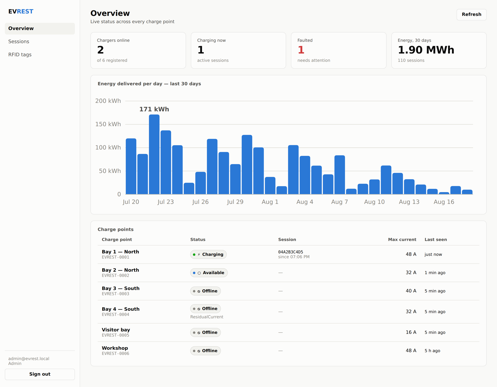
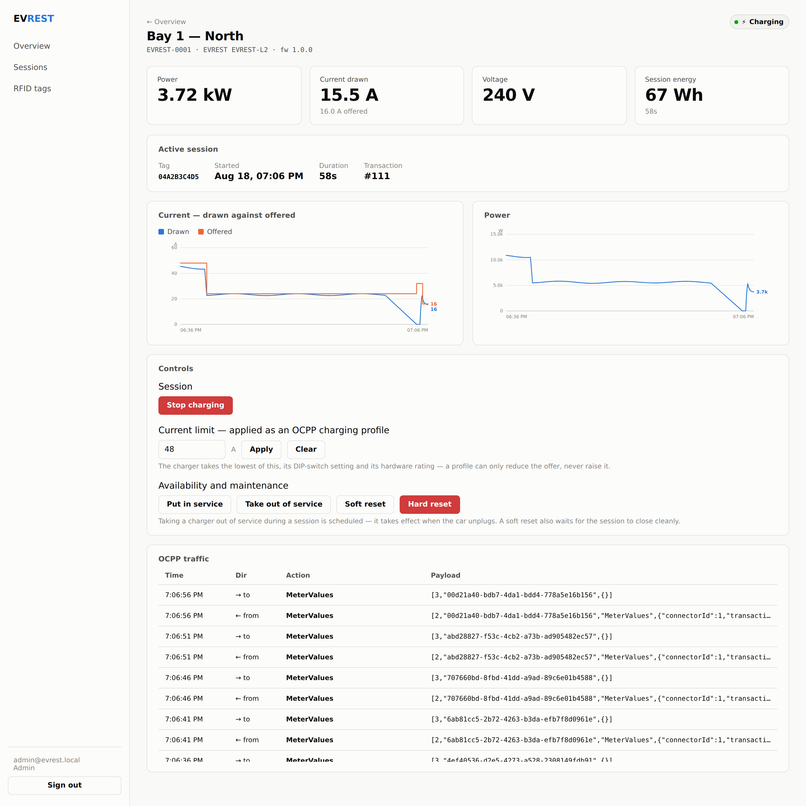

# EVREST dashboard

Operator web UI for the CSMS. React 18, Vite, TypeScript. No chart library —
the two chart components are hand-rolled SVG, which is a few hundred lines and
removes a dependency from a project that already has enough of them.

## Running

```sh
npm install
npm run dev        # http://localhost:5173, proxying /api and /live to :9221
npm run build      # static files in dist/, serve them from anywhere
```

The dev server proxies to the CSMS on `127.0.0.1:9221`, so there is no CORS
setup and the production build works unchanged when served from the same origin
as the API.

Routing is hash-based, so deep links work from a plain static file server with
no catch-all rewrite rule.

## Pages

| Route | What it is |
|---|---|
| `/` | Fleet overview: KPI tiles, 30-day energy, charge point table |
| `/chargers/:id` | Live detail, remote controls, OCPP traffic |
| `/transactions` | Session history |
| `/tags` | RFID tag management (operator and above) |

Drivers get a reduced view: no tag management, no OCPP log, and the API refuses
to let them start or stop a session with a tag that is not theirs. The
navigation hides what they cannot do rather than showing links that 403.

## Design decisions

**Colours are roles, not hex.** Everything is a CSS custom property in
`theme.css`, defined for light and re-stated for dark. Dark is a palette
*selected* for the dark surface, not an inversion; both were run through a
colourblind-safety validator (adjacent CVD ΔE 9.2 light / 9.4 dark against an
≥8 target, normal-vision 27.6 / 26.5 against an ≥15 floor).

**Status is never colour alone.** Every badge carries a dot, a glyph and a word,
so it survives colourblindness, greyscale printing and `forced-colors`.

**No dual-axis charts.** Current-drawn and current-offered share one chart
because they share a unit, and that comparison is the point — a gap between them
means the charger is throttling. Power gets its own chart rather than a second
y-axis, because a dual-axis plot invents a correlation by choosing where the two
scales line up.

**Axis ticks are chosen by step, not by dividing the maximum.** Picking a "nice"
maximum and quartering it gives ticks at 12.5 and 37.5, which render as 13 and
38 and read as arbitrary. `lib/scale.ts` picks a round step first and lets the
maximum follow.

**Direct labels are spread apart.** Two series whose last values are close —
exactly when a reader wants to compare them — would otherwise render on top of
each other. `spreadLabels()` nudges them to a minimum gap.

**Gaps in the data are drawn as gaps.** A missing meter sample breaks the line
rather than being bridged, because bridging invents readings across an outage.

**One WebSocket for the whole app.** Opening one per component would multiply
connections by the number of open panels and make each of them repeat the
reconnection logic. `lib/live.ts` owns a single connection with exponential
backoff to 30 s, so a CSMS restart is not met by every dashboard reconnecting at
once.

**Live events patch rows in place.** The fleet page does not refetch on every
meter sample — that would be a request per charger per interval, which is the
load a live feed exists to avoid. Only session boundaries, which change derived
totals, trigger a refetch.

## Screenshots





## Trying it without hardware

The CSMS ships a charge point simulator. From `csms/`:

```sh
npx tsx test/seed-demo.ts ./demo.db          # 6 chargers, 30 days of sessions
DB_PATH=./demo.db JWT_SECRET=$(openssl rand -hex 32) npm run dev
npx tsx test/fake-charger.ts EVREST-0001 demo-key
```

The simulator speaks real OCPP 1.6J — it responds to remote start/stop, charging
profiles, resets and TriggerMessage — so the whole stack can be exercised from
the dashboard. Type `s` in its terminal to plug in or unplug, `f` to raise a
fault.
