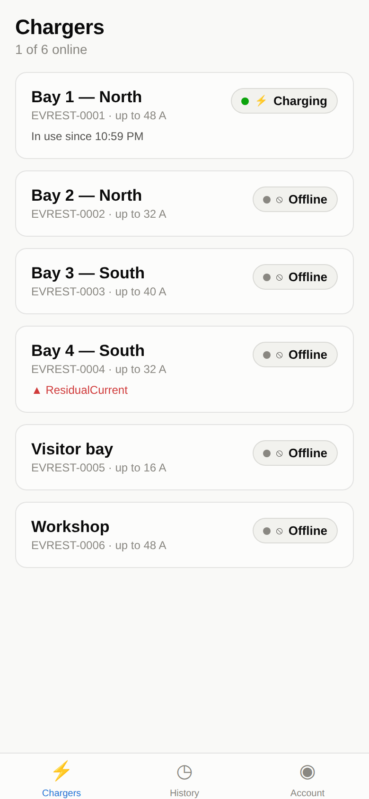
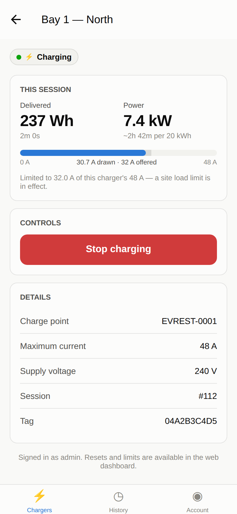

# EVREST driver app

React Native (Expo), TypeScript. Talks to the CSMS REST API — it does not speak
OCPP itself, and should not: the charger's protocol connection belongs to the
Central System.

## Running

```sh
npm install
npm start              # then scan the QR with Expo Go, or press a / i / w
```

The CSMS address is configurable in the app (Server settings on the login
screen, or Account → Server), because a phone points at a different host
depending on whether it is on the site Wi-Fi, on cellular through a public
endpoint, or on a bench emulator. The default in `app.json` is `10.0.2.8:9221`,
which is what an Android emulator sees as the host machine.

Saving a new address signs the user out — a token issued by one CSMS is
meaningless to another, and staying signed in would produce a confusing 401 on
the next request instead of a login screen.

## Screens

| Screen | What it does |
|---|---|
| Chargers | Every charge point, sorted so what a driver can act on is at the top |
| Charger detail | Live session, current meter, start/stop |
| History | Their own sessions, with month and lifetime totals |
| Account | Their tags, the server address, sign out |

## Decisions worth knowing

**The API enforces the permissions, not the app.** A driver can only start a
session with a tag assigned to them, and only stop a session started with one of
their own tags. The app is not a trusted component, so those checks live in
`csms/src/api/rest.ts`; the app just avoids offering what will be refused.

**The current meter is a bar, not a number.** The interesting fact is the
*ratio*: a car drawing 16 A of an offered 16 A is fine, and drawing 16 A of an
offered 48 A means something is limiting it. When the offer is below the
charger's rating the screen says so in words — "why is it charging slowly" is
the most common support question, and the answer is nearly always a site load
limit.

**Status is a dot, a glyph and a word.** Never colour alone, which matters more
on a phone held at arm's length in sunlight than it does on a desk monitor.

**Detail polls at 3 s, the list at 5 s.** The detail screen is what someone
stares at while waiting for their car to start drawing current, and a stale
reading there reads as "it isn't working".

**A connection failure opens the server field.** On a phone, a failed request is
nearly always the wrong address or no signal, so the app says which and puts the
fix on screen rather than making the driver hunt for it.

**Time estimates are honest about what they are.** The app has no idea of the
battery's capacity or state of charge — only what the charger is delivering — so
it answers "how long to add 20 kWh at the present rate" rather than pretending
to know when the car will be full.

**No icon font.** Five tab icons do not justify a vector icon package, an asset
pipeline and another thing to keep in sync with the theme. Text glyphs render
identically on both platforms and inherit the tint colour.

## Screenshots

Rendered against a live CSMS with a simulated charger drawing 30.7 A of an
offered 32 A on a 48 A unit.

| Chargers | Session |
|---|---|
|  |  |

## Trying it without hardware

Start the CSMS with demo data and a simulated charger (see `csms/README.md`),
then point the app at your machine's LAN address — `http://192.168.x.x:9221`,
not `localhost`, since the phone is a different device.
